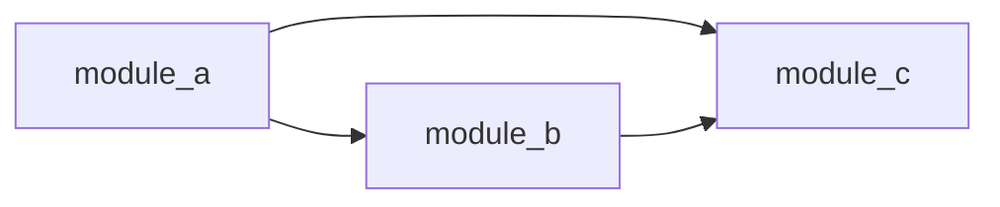

# Impact Flow Analysis

Analyze codebase dependencies, measure change impact, score health, and trace execution paths.

## Token Efficiency Note

This skill uses **Serena MCP as the primary tool** for significant cost savings:

| Approach | Token Usage | Cost Impact |
|----------|-------------|-------------|
| Serena (symbol metadata) | ~500 tokens/file | **Baseline** |
| Native (read full files) | ~30,000 tokens/file | **60x more expensive** |

**Always try Serena first**, then fall back to native tools if Serena fails.

---

## Mode Selection

Determine the analysis mode from user intent:

| User Intent | Mode | Jump To |
|-------------|------|---------|
| "dependency graph", "what imports X", "module relationships" | **Dependency Graph** | [Mode 1](#mode-1-dependency-graph) |
| "blast radius", "if I change X", "what's affected" | **Blast Radius** | [Mode 2](#mode-2-blast-radius) |
| "health score", "codebase health", "tech debt" | **Health Score** | [Mode 3](#mode-3-health-score) |
| "trace through", "call path", "execution flow" | **Flow Trace** | [Mode 4](#mode-4-flow-trace) |
| "full analysis", "comprehensive", "analyze everything" | **Comprehensive** | [Mode 5](#mode-5-comprehensive-analysis) |
| "dead code", "unused", "safe to delete" | **Dead Code** | Use Mode 1, filter exports with 0 refs |

If mode is ambiguous, ask: "Would you like me to analyze **dependencies**, **impact**, **health**, **execution flow**, or run a **comprehensive analysis**?"

---

## Mode 1: Dependency Graph

**Goal**: Visualize who imports what across the codebase.

### Workflow

1. **Activate project** (if using Serena)
   ```
   → activate_project(project_name)
   → check_onboarding_performed()
   ```

2. **Identify scope**
   - Single file: Analyze that file's exports and imports
   - Directory: Analyze all code files in directory
   - Whole codebase: Start from entry points or high-level modules

3. **Collect exports** (parallel where possible)
   ```
   PRIMARY (Serena):
   For each file in scope:
     → get_symbols_overview(relative_path=file, depth=0)
     → Record exported classes, functions, constants

   FALLBACK (Native):
   For each file in scope:
     → Grep pattern="^(def |class |export |function )" glob="*.py"
     → Parse results to extract symbol names
   ```

4. **Trace references** (parallel per symbol)
   ```
   PRIMARY (Serena):
   For each exported symbol:
     → find_referencing_symbols(name_path=symbol, relative_path=file)
     → Record: importer_file → symbol → source_file

   FALLBACK (Native):
   For each exported symbol:
     → Grep pattern="symbol_name\s*\(" path=scope
     → Filter to exclude definition line
   ```

5. **Build adjacency list**
   ```
   graph = {}
   for each reference:
     graph[importer] = graph.get(importer, []) + [imported]
   ```

6. **Calculate coupling metrics**
   - Afferent coupling (Ca): Number of files that depend on this file
   - Efferent coupling (Ce): Number of files this file depends on
   - Instability (I): Ce / (Ca + Ce) — 0=stable, 1=unstable

7. **Generate output**
   - Mermaid diagram (see `references/report-templates.md`)
   - High-coupling warnings (Ca > 10 or Ce > 10)
   - Cycle detection (if A→B and B→A)

### Output Format

```markdown
## Dependency Graph: [scope]

### Visualization


### Coupling Analysis
| Module | Afferent (Ca) | Efferent (Ce) | Instability |
|--------|---------------|---------------|-------------|
| module_a | 0 | 2 | 1.00 (unstable) |
| module_b | 1 | 1 | 0.50 |
| module_c | 2 | 0 | 0.00 (stable) |

### Warnings
- ⚠️ `module_a` has high efferent coupling (depends on many modules)
- 🔄 Cycle detected: module_x ↔ module_y
```

---

## Mode 2: Blast Radius

**Goal**: Assess impact of changing a specific symbol or file.

### Workflow

1. **Locate target**
   ```
   PRIMARY (Serena):
   → find_symbol(name_path_pattern=symbol, relative_path=file, include_body=false)
   → Confirm: "Analyzing impact of [symbol] in [file]"

   FALLBACK (Native):
   → Grep pattern="(def|class|function)\s+symbol_name" path=scope
   → Read file to get context
   ```

2. **Collect direct dependents (depth 1)**
   ```
   PRIMARY (Serena):
   → find_referencing_symbols(name_path=target, relative_path=file)
   → Store as level_1_refs

   FALLBACK (Native):
   → Grep pattern="symbol_name\s*[\(\.]" path=scope output_mode=content
   → Parse file:line from results
   ```

3. **Recurse to configured depth** (default: 3)
   ```
   For depth 2..N:
     For each ref in previous_level:
       → find_referencing_symbols(name_path=ref.symbol, relative_path=ref.file)
       → Store as level_N_refs
     Stop early if no new refs found
   ```

4. **Calculate blast radius metrics**
   - `affected_files`: Unique files containing references
   - `total_files`: Count from list_dir(recursive=true)
   - `blast_percentage`: affected_files / total_files * 100

5. **Assign risk level**
   | Percentage | Risk | Recommendation |
   |------------|------|----------------|
   | >30% | 🔴 Critical | Requires extensive testing, consider feature flag |
   | 15-30% | 🟠 High | Integration tests required, staged rollout |
   | 5-15% | 🟡 Medium | Unit tests + affected component tests |
   | <5% | 🟢 Low | Standard testing sufficient |

6. **Generate impact tree** (see `references/report-templates.md`)

### Output Format

```markdown
## Blast Radius: `function_name`

**Risk Level**: 🟠 High (22% of codebase affected)

### Impact Tree
```
function_name (target)
├── caller_a.py:45 [DIRECT]
│   ├── handler_x.py:102
│   └── handler_y.py:88
├── caller_b.py:33 [DIRECT]
│   └── main.py:15
└── caller_c.py:78 [DIRECT]
```

### Summary
- **Direct callers**: 3 files
- **Indirect callers**: 4 files
- **Total affected**: 7 files (22% of 32 code files)

### Recommendations
1. Write tests for `caller_a`, `caller_b`, `caller_c` before modifying
2. Consider staged rollout given handler dependencies
3. Review `handler_x` and `handler_y` for interface assumptions
```

---

## Mode 3: Health Score

**Goal**: Generate unified A-F health grade for codebase or directory.

### Workflow

1. **Collect metrics in parallel**:
   ```
   Task A: Count files
     PRIMARY: list_dir(relative_path=scope, recursive=true)
     FALLBACK: Glob pattern="**/*.py" (or appropriate extension)

   Task B: Count symbols
     PRIMARY: get_symbols_overview on sample files (up to 20)
     FALLBACK: Grep pattern="^(def |class )" output_mode=count

   Task C: Find dead code
     PRIMARY: exports with 0 references via find_referencing_symbols
     FALLBACK: Skip or use heuristics

   Task D: Check test coverage
     → Ratio of test files (test_*.py, *_test.py, *.spec.*)

   Task E: Check documentation
     PRIMARY: find_symbol with include_info=true, check for docstrings
     FALLBACK: Grep pattern='"""' or pattern="'''" for docstrings
   ```

2. **Calculate component scores** (see `references/health-metrics.md` for formulas)

   | Metric | Weight | Calculation |
   |--------|--------|-------------|
   | Coupling | 25% | 100 - (avg_refs_per_export * 5), min 0 |
   | Complexity | 25% | 100 - (avg_branches_per_function * 3), min 0 |
   | Dead Code | 20% | 100 - (dead_exports / total_exports * 100) |
   | Test Coverage | 15% | (test_files / code_files) * 100, max 100 |
   | Documentation | 15% | (documented_symbols / total_symbols) * 100 |

3. **Compute composite score**
   ```
   score = Σ(metric_score * weight)
   ```

4. **Assign grade**
   | Score | Grade | Description |
   |-------|-------|-------------|
   | 90-100 | A | Excellent - Well-maintained, low debt |
   | 80-89 | B | Good - Minor issues, sustainable |
   | 70-79 | C | Fair - Notable tech debt, plan improvements |
   | 60-69 | D | Poor - Significant issues, prioritize fixes |
   | <60 | F | Critical - Major refactoring needed |

5. **Identify top issues** (lowest-scoring metrics)

### Output Format

```markdown
## Health Score: [scope]

# Grade: B (84/100)

### Metric Breakdown
| Metric | Score | Weight | Weighted |
|--------|-------|--------|----------|
| Coupling | 78 | 25% | 19.5 |
| Complexity | 85 | 25% | 21.25 |
| Dead Code | 92 | 20% | 18.4 |
| Test Coverage | 80 | 15% | 12.0 |
| Documentation | 86 | 15% | 12.9 |
| **Total** | | | **84.05** |

### Top Issues
1. **Coupling** (78): `auth/permissions.py` has 15 dependents
2. **Test Coverage** (80): `utils/` directory has no tests

### Recommendations
1. Extract interface from `auth/permissions.py` to reduce coupling
2. Add unit tests for utility functions
```

---

## Mode 4: Flow Trace

**Goal**: Trace execution path from entry point through call tree.

### Workflow

1. **Identify entry point**
   ```
   PRIMARY (Serena):
   → find_symbol(name_path_pattern=entry_function, relative_path=file, include_body=true)
   → Parse function body for called functions

   FALLBACK (Native):
   → Read file containing entry point
   → Use regex to extract function calls
   ```

2. **Extract calls from body**
   - Look for: function calls, method calls, constructor calls
   - Pattern: `identifier(` or `self.method(` or `ClassName(`

3. **Recursively trace** (with cycle detection)
   ```
   visited = set()

   def trace(symbol, depth):
     if symbol in visited or depth > max_depth:
       return "[CYCLE]" or "[MAX DEPTH]"
     visited.add(symbol)

     body = find_symbol(name_path_pattern=symbol, include_body=true)
     calls = extract_calls(body)

     for call in calls:
       trace(call, depth + 1)
   ```

4. **Build call tree** with depth indicators

5. **Annotate with metadata**
   - File locations
   - Async/sync markers (look for `async def`, `await`)
   - External dependency markers (imports from packages)

### Output Format

```markdown
## Flow Trace: `process_request`

### Call Tree
```
process_request(request) → handlers/main.py:45
├── validate_input(request.data) → validators/input.py:12
│   ├── check_schema(data) → validators/schema.py:33
│   └── sanitize(data) → utils/sanitize.py:8
├── authenticate(request.headers) → auth/authenticate.py:22
│   ├── decode_token(token) → auth/jwt.py:15 [EXTERNAL: pyjwt]
│   └── get_user(user_id) → db/users.py:44 [ASYNC]
└── handle_action(user, data) → handlers/actions.py:88
    └── save_result(result) → db/storage.py:102 [ASYNC]
```

### Flow Summary
- **Total calls**: 8
- **Unique functions**: 8
- **External dependencies**: pyjwt
- **Async boundaries**: 2 (get_user, save_result)

### Notes
- Authentication happens before action handling
- Two database calls could be parallelized
```

---

## Mode 5: Comprehensive Analysis

**Goal**: Run all modes and generate unified report.

### Workflow

1. **Run Health Score first** (establishes baseline)
   ```
   → Execute Mode 3 workflow
   → Store health_grade, metrics, top_issues
   ```

2. **Run Dependency Graph** (structural context)
   ```
   → Execute Mode 1 workflow
   → Store graph, coupling_data, cycles
   ```

3. **Identify high-risk symbols** from coupling data
   ```
   high_risk_symbols = [
     symbols where Ca > 10 OR
     symbols in cycles OR
     symbols flagged in top_issues
   ]
   ```

4. **Run Blast Radius** on top 3 high-risk symbols
   ```
   For each high_risk_symbol (limit 3):
     → Execute Mode 2 workflow
     → Store impact_data
   ```

5. **Run Flow Trace** on main entry point(s)
   ```
   → Find entry points: main(), app(), handler patterns
   → Execute Mode 4 workflow on primary entry
   → Store call_tree
   ```

6. **Compile unified report**
   ```
   → Executive summary with grade and key metrics
   → Dependency visualization
   → Impact analysis for high-risk areas
   → Execution flow overview
   → Prioritized recommendations
   ```

### Output Format

See the report generated during testing for a complete example. Key sections:

```markdown
# Impact Flow Analysis Report: [project]

## Executive Summary
| Metric | Value | Status |
|--------|-------|--------|
| Health Grade | [A-F] | [status] |
| Total LOC | [N] | |
| Coupling Level | [Low/Med/High] | |
| Code Duplication | [Low/Med/High] | |

## Mode 1: Dependency Graph
[Graph output]

## Mode 2: Blast Radius Analysis
[Impact trees for high-risk symbols]

## Mode 3: Health Score
[Detailed metrics]

## Mode 4: Flow Trace
[Call trees]

## Recommendations
[Prioritized action items]
```

---

## Tool Reference

### Primary Tools (Serena MCP) — Use First

| Tool | Correct Parameters | Purpose |
|------|-------------------|---------|
| `activate_project` | `project` (name or path) | Required before other Serena tools |
| `get_symbols_overview` | `relative_path`, `depth` (0-2) | List exports/symbols efficiently |
| `find_symbol` | `name_path_pattern`, `relative_path`, `include_body`, `depth` | Locate symbol with optional body |
| `find_referencing_symbols` | `name_path`, `relative_path` | Find callers/importers |
| `list_dir` | `relative_path`, `recursive` | Count files, discover structure |
| `search_for_pattern` | `substring_pattern`, `relative_path`, `context_lines_*` | Regex search in code |
| `read_file` | `relative_path`, `start_line`, `end_line` | Read file chunk |

**Important Parameter Notes:**
- Use `name_path_pattern` (not `name_path`) for `find_symbol`
- Use `substring_matching=true` for partial symbol names
- Set `include_body=false` unless you need the full code (saves tokens)

### Fallback Tools (Claude Code Native) — Use When Serena Fails

| Tool | Purpose | When to Use |
|------|---------|-------------|
| `Grep` | Pattern search | Serena search_for_pattern returns empty |
| `Glob` | Find files by pattern | Serena list_dir fails |
| `Read` | Read file contents | Serena read_file fails |
| `Bash` | Run commands (wc, git) | Line counts, git history |

### Fallback Decision Logic

```
try:
    result = serena_tool(params)
    if result is empty or error:
        raise FallbackNeeded
except (Error, FallbackNeeded):
    result = native_tool(equivalent_params)
```

---

## Language-Specific Patterns

### Python
```
Import detection: ^(from\s+\S+\s+import|import\s+)
Entry points: if __name__ == "__main__"
Test files: test_*.py, *_test.py, tests/
Docstrings: """...""" or '''...'''
```

### TypeScript/JavaScript
```
Import detection: ^import\s+|^const\s+\w+\s*=\s*require\(
Entry points: package.json main/bin fields
Test files: *.test.ts, *.spec.ts, __tests__/
```

### Rust
```
Import detection: ^use\s+
Entry points: fn main() in src/main.rs or src/bin/
Test files: #[cfg(test)] modules, tests/
```

### Go
```
Import detection: ^import\s+[\("']
Entry points: func main() in main.go
Test files: *_test.go
```

---

## Troubleshooting

### "No symbol matching X found"

**Cause**: Serena's LSP didn't index the symbol, or name doesn't match exactly.

**Solutions**:
1. Try `substring_matching=true` in find_symbol
2. Use `search_for_pattern` to locate the symbol first
3. Fall back to Grep: `Grep pattern="def symbol_name\s*\(" path=scope`

### Empty import/reference results from Serena

**Cause**: Serena's search may not parse all file types or patterns.

**Solutions**:
1. Use native Grep (more reliable for regex):
   ```
   Grep pattern="^(import|from)" glob="*.py" output_mode=content
   ```
2. Check if files are in Serena's scope (activate_project first)

### "Project not activated" errors

**Cause**: Serena requires explicit project activation.

**Solution**:
```
→ activate_project(project_name_or_path)
→ check_onboarding_performed()
Then proceed with analysis
```

### High token usage despite using Serena

**Cause**: Using `include_body=true` or reading full files unnecessarily.

**Solutions**:
1. Use `include_body=false` for discovery, only `true` when needed
2. Use `depth=0` for initial overview, increase only if needed
3. Limit file reads to specific line ranges

### find_symbol returns too many results

**Cause**: Common symbol name matches across codebase.

**Solutions**:
1. Provide `relative_path` to narrow scope
2. Use full name_path_pattern: `ClassName/method_name`
3. Filter results by file path pattern

---

## Example Invocations

### Quick health check
```
User: "How healthy is this codebase?"
→ Run Mode 3 only
→ Output: Grade + top 3 issues + brief recommendations
```

### Pre-refactor analysis
```
User: "I want to refactor the auth module"
→ Run Mode 2 on key auth symbols (find high-Ca symbols first)
→ Run Mode 1 on auth/ directory
→ Output: Risk assessment + dependency map + affected tests
```

### PR impact assessment
```
User: "What's the impact of changing UserService?"
→ Run Mode 2 with depth=3 on UserService
→ List affected test files
→ Output: Risk level + impact tree + recommended test commands
```

### New developer onboarding
```
User: "Help me understand this codebase"
→ Run Mode 5 (comprehensive)
→ Output: Full report with health, dependencies, and main flows
```

### Dead code hunt
```
User: "Find unused code I can safely delete"
→ Run Mode 1 on scope
→ Filter to exports with 0 references
→ Exclude: entry points, test fixtures, public API
→ Output: List of likely-dead symbols with locations
```

---

## Agent Deferral

When user requests overlap with existing specialized agents, defer appropriately.

| User Request | Defer To | Handoff Phrasing |
|--------------|----------|------------------|
| "Find security vulnerabilities" | security-sentinel | "For security scanning, I recommend using **security-sentinel**. Would you like me to invoke it?" |
| "Detect anti-patterns" | pattern-recognition-specialist | "Pattern detection is handled by **pattern-recognition-specialist**. Shall I run that analysis?" |
| "Check architecture compliance" | architecture-strategist | "Architecture review is **architecture-strategist**'s specialty. Want me to start that?" |
| "Analyze performance bottlenecks" | performance-oracle | "Performance analysis is best handled by **performance-oracle**. Should I invoke it?" |

### Complementary Workflows

Impact-flow works well **before or after** other agents:

1. **Before architecture-strategist**: Run dependency graph first to provide structural context
2. **After security-sentinel**: Run blast radius on flagged vulnerabilities to prioritize fixes
3. **Before refactoring**: Run health score to identify highest-debt areas
4. **After pattern-recognition**: Trace flow through detected anti-patterns

---

## Quick Reference

| Mode | Command | Key Output |
|------|---------|------------|
| Dependency Graph | `impact-flow dependencies [file/dir]` | Mermaid diagram + coupling |
| Blast Radius | `impact-flow impact [symbol]` | Risk level + impact tree |
| Health Score | `impact-flow health [scope]` | Grade A-F + metrics |
| Flow Trace | `impact-flow trace [function]` | Call tree + annotations |
| Comprehensive | `impact-flow analyze [scope]` | Full report (all modes) |

For detailed algorithms, see `references/health-metrics.md` and `references/dependency-analysis.md`.
For output templates, see `references/report-templates.md`.
For agent integration details, see `references/agent-integration.md`.
For troubleshooting, see the [Troubleshooting](#troubleshooting) section above.
