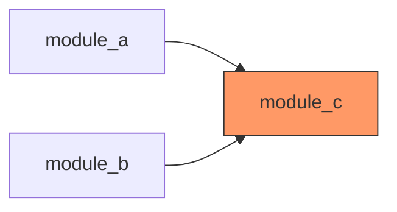

# Dependency Analysis Reference

Graph building algorithms, traversal strategies, and visualization generation.

---

## Graph Data Structures

### Adjacency List Representation

```python
# Primary structure: module -> list of dependencies
graph = {
    "module_a": ["module_b", "module_c"],
    "module_b": ["module_c"],
    "module_c": []
}

# Reverse graph for finding dependents
reverse_graph = {
    "module_a": [],  # nothing depends on a
    "module_b": ["module_a"],  # a depends on b
    "module_c": ["module_a", "module_b"]  # a and b depend on c
}
```

### Edge Metadata

```python
edges = {
    ("module_a", "module_b"): {
        "symbols": ["ClassX", "function_y"],
        "import_type": "explicit",  # or "wildcard", "dynamic"
        "line_numbers": [5, 12]
    }
}
```

---

## Graph Building Algorithm

### Step 1: Collect Nodes (Files/Modules)

```
nodes = []
for file in list_dir(scope, recursive=true):
    if is_code_file(file):
        nodes.append(normalize_module_name(file))
```

### Step 2: Collect Edges (Dependencies)

```
edges = []
for node in nodes:
    exports = get_symbols_overview(node)
    for export in exports:
        refs = find_referencing_symbols(export, node)
        for ref in refs:
            edges.append({
                source: ref.file,
                target: node,
                symbol: export.name
            })
```

### Step 3: Build Adjacency Lists

```
graph = defaultdict(set)
reverse_graph = defaultdict(set)

for edge in edges:
    graph[edge.source].add(edge.target)
    reverse_graph[edge.target].add(edge.source)
```

---

## Cycle Detection

### Depth-First Search Algorithm

```python
def detect_cycles(graph):
    """Find all cycles in directed graph."""
    visited = set()
    rec_stack = set()
    cycles = []

    def dfs(node, path):
        visited.add(node)
        rec_stack.add(node)
        path.append(node)

        for neighbor in graph.get(node, []):
            if neighbor not in visited:
                dfs(neighbor, path)
            elif neighbor in rec_stack:
                # Found cycle
                cycle_start = path.index(neighbor)
                cycles.append(path[cycle_start:] + [neighbor])

        path.pop()
        rec_stack.remove(node)

    for node in graph:
        if node not in visited:
            dfs(node, [])

    return cycles
```

### Cycle Reporting

```
Cycle detected: A → B → C → A

Involved modules:
  - A (file_a.py) imports B
  - B (file_b.py) imports C
  - C (file_c.py) imports A ← breaks cycle

Recommendations:
  1. Extract shared interface
  2. Invert dependency direction
  3. Introduce mediator module
```

---

## Coupling Metrics

### Afferent Coupling (Ca)

Number of modules that depend on this module.

```
Ca(module) = len(reverse_graph[module])
```

High Ca indicates:
- Module is widely used
- Changes have high blast radius
- May indicate a "god module" anti-pattern

### Efferent Coupling (Ce)

Number of modules this module depends on.

```
Ce(module) = len(graph[module])
```

High Ce indicates:
- Module has many dependencies
- Potentially violates single responsibility
- May be fragile to changes in dependencies

### Instability Index (I)

```
I = Ce / (Ca + Ce)

Where:
  I = 0 → Maximally stable (many dependents, few dependencies)
  I = 1 → Maximally unstable (few dependents, many dependencies)
```

Ideal architecture:
- Core modules: I close to 0 (stable)
- Peripheral modules: I close to 1 (unstable)
- Dependency direction: unstable → stable

---

## Depth-Limited Search for Impact Analysis

### Algorithm

```python
def impact_search(target, graph, max_depth=3):
    """Find all nodes affected by changes to target."""
    affected = {}  # node -> depth
    queue = [(target, 0)]
    visited = {target}

    while queue:
        current, depth = queue.pop(0)

        if depth > max_depth:
            continue

        for dependent in reverse_graph.get(current, []):
            if dependent not in visited:
                visited.add(dependent)
                affected[dependent] = depth + 1
                queue.append((dependent, depth + 1))

    return affected
```

### Early Termination

Stop recursion when:
1. No new nodes found at current depth
2. Max depth reached
3. Affected percentage exceeds threshold (e.g., >50%)

---

## Mermaid Diagram Generation

### Basic Graph

```python
def to_mermaid(graph, title="Dependency Graph"):
    lines = ["graph LR"]

    # Sanitize node names for Mermaid
    def safe_name(name):
        return name.replace("/", "_").replace(".", "_")

    for source, targets in graph.items():
        for target in targets:
            lines.append(f"    {safe_name(source)} --> {safe_name(target)}")

    return "\n".join(lines)
```

### With Subgraphs (Directory Grouping)

```python
def to_mermaid_grouped(graph):
    lines = ["graph TB"]
    groups = defaultdict(list)

    # Group by top-level directory
    for node in set(graph.keys()) | set(t for ts in graph.values() for t in ts):
        group = node.split("/")[0] if "/" in node else "root"
        groups[group].append(node)

    # Generate subgraphs
    for group, nodes in groups.items():
        lines.append(f"    subgraph {group}")
        for node in nodes:
            lines.append(f"        {safe_name(node)}[{node}]")
        lines.append("    end")

    # Generate edges
    for source, targets in graph.items():
        for target in targets:
            lines.append(f"    {safe_name(source)} --> {safe_name(target)}")

    return "\n".join(lines)
```

### Styling High-Coupling Nodes



---

## Performance Considerations

### Large Codebases (>1000 files)

1. **Sample instead of exhaustive scan**
   - Analyze top-level directories first
   - Deep dive into high-coupling areas

2. **Parallel symbol lookups**
   - Batch `find_referencing_symbols` calls
   - Use parallel Task execution

3. **Cache results**
   - Store graph in memory during session
   - Invalidate on file changes

4. **Limit visualization**
   - Show only edges with weight > threshold
   - Group by directory at high level
   - Drill down on request

### Complexity Bounds

| Operation | Complexity |
|-----------|------------|
| Build graph | O(N × M) where N=files, M=avg exports |
| Cycle detection | O(V + E) |
| Impact search (depth d) | O(branching_factor^d) |
| Coupling calculation | O(N) |

---

## Module Name Normalization

Convert file paths to consistent module identifiers:

```python
def normalize_module_name(file_path, project_root):
    """Convert file path to module name."""
    # Remove project root
    relative = file_path.replace(project_root + "/", "")

    # Remove extension
    if relative.endswith(".py"):
        relative = relative[:-3]
    elif relative.endswith(".ts") or relative.endswith(".js"):
        relative = relative[:-3]

    # Convert path separators to dots (Python style) or keep slashes
    # Depends on language convention

    return relative
```

### Language-Specific Patterns

| Language | Import Pattern | Module ID |
|----------|---------------|-----------|
| Python | `from pkg.mod import X` | `pkg/mod` |
| JavaScript | `import X from './mod'` | `./mod` or `mod` |
| TypeScript | `import { X } from '@pkg/mod'` | `@pkg/mod` |
| Go | `import "pkg/mod"` | `pkg/mod` |
| Rust | `use crate::mod::X` | `crate::mod` |

---

## Fallback Strategies

When Serena tools fail or return empty results, use these native tool alternatives.

### Import Detection Fallbacks

**Python:**
```bash
# Primary: Serena
search_for_pattern(substring_pattern="^(from|import)\s+", relative_path="src/")

# Fallback: Native Grep (more reliable)
Grep pattern="^(from\s+\S+\s+import|import\s+)" glob="*.py" output_mode=content
```

**TypeScript/JavaScript:**
```bash
# Primary: Serena
search_for_pattern(substring_pattern="^import\s+", relative_path="src/")

# Fallback: Native Grep
Grep pattern="^import\s+|^const\s+\w+\s*=\s*require\(" glob="*.{ts,js,tsx,jsx}" output_mode=content
```

### Symbol Discovery Fallbacks

**When get_symbols_overview fails:**
```bash
# Python functions/classes
Grep pattern="^(def|class|async def)\s+\w+" glob="*.py" output_mode=content

# TypeScript exports
Grep pattern="^export\s+(const|function|class|interface|type)" glob="*.ts" output_mode=content
```

**When find_referencing_symbols fails:**
```bash
# Find function calls
Grep pattern="function_name\s*\(" path="src/" output_mode=content

# Find class instantiations
Grep pattern="new\s+ClassName\s*\(" path="src/" output_mode=content

# Find method calls
Grep pattern="\.method_name\s*\(" path="src/" output_mode=content
```

### File Counting Fallbacks

**When list_dir fails:**
```bash
# Count Python files
Glob pattern="**/*.py" path="src/"

# Count with line numbers
Bash command="find src/ -name '*.py' -type f | wc -l"

# Get line counts per file
Bash command="wc -l src/**/*.py | sort -n"
```

### Decision Matrix

| Serena Tool | Failure Mode | Fallback Tool | Notes |
|-------------|--------------|---------------|-------|
| `get_symbols_overview` | Empty result | `Grep ^(def\|class)` | Less precise, catches definitions |
| `find_symbol` | "No symbol found" | `Grep symbol_name` | May return false positives |
| `find_referencing_symbols` | Error | `Grep symbol\s*\(` | Requires manual filtering |
| `list_dir` | Project not activated | `Glob **/*.ext` | Works without Serena |
| `search_for_pattern` | Empty | `Grep pattern` | Grep is more reliable for regex |

### Token Cost Comparison

| Operation | Serena Tokens | Native Tokens | Ratio |
|-----------|---------------|---------------|-------|
| List symbols in file | ~500 | ~30,000 (read file) | 60:1 |
| Find references | ~100/ref | ~500/match + context | 5:1 |
| Count files | ~200 | ~50 | 0.25:1 (native cheaper) |
| Search pattern | ~300 | ~100 | 0.33:1 (native cheaper) |

**Recommendation**: Use Serena for symbol operations, native for file discovery and pattern search.
