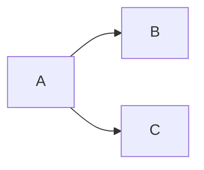
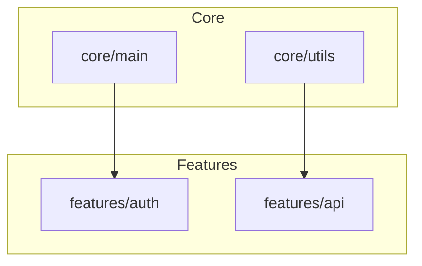

# Report Templates Reference

Output format templates for each analysis mode. Use these as templates when generating reports.

---

## Dependency Graph Report

### Full Template

```markdown
## Dependency Graph: [SCOPE_NAME]

**Generated**: [TIMESTAMP]
**Scope**: [file/directory/codebase]
**Files Analyzed**: [COUNT]

### Visualization

```mermaid
graph LR
    subgraph [MODULE_GROUP_1]
        A[module_a]
        B[module_b]
    end
    subgraph [MODULE_GROUP_2]
        C[module_c]
        D[module_d]
    end
    A --> C
    B --> C
    B --> D
    C --> D
```

### Coupling Analysis

| Module | Afferent (Ca) | Efferent (Ce) | Instability (I) | Status |
|--------|---------------|---------------|-----------------|--------|
| module_a | 0 | 1 | 1.00 | 🟡 Unstable |
| module_b | 0 | 2 | 1.00 | 🟡 Unstable |
| module_c | 2 | 1 | 0.33 | 🟢 Balanced |
| module_d | 2 | 0 | 0.00 | 🟢 Stable |

### High Coupling Modules

| Module | Issue | Recommendation |
|--------|-------|----------------|
| [MODULE] | Ca=[N] (high afferent) | Extract interface to reduce dependents |
| [MODULE] | Ce=[N] (high efferent) | Consider splitting responsibilities |

### Dependency Cycles

```
⚠️ Cycle 1: module_x → module_y → module_x
⚠️ Cycle 2: a → b → c → a
```

### Statistics
- **Total modules**: [N]
- **Total edges**: [N]
- **Average coupling**: [N]
- **Cycles detected**: [N]
```

### Mermaid Diagram Guidelines

**For small graphs (<20 nodes):**


**For medium graphs (20-50 nodes):**


**For large graphs (>50 nodes):**
- Group by directory/module
- Show only high-coupling edges
- Or break into multiple diagrams

---

## Blast Radius Report

### Full Template

```markdown
## Blast Radius Analysis: `[SYMBOL_NAME]`

**Target**: `[symbol_name]` in `[file_path]:[line]`
**Analysis Depth**: [N] levels
**Generated**: [TIMESTAMP]

### Risk Assessment

| Metric | Value |
|--------|-------|
| **Risk Level** | [🔴 Critical / 🟠 High / 🟡 Medium / 🟢 Low] |
| **Blast Percentage** | [N]% of codebase |
| **Direct Dependents** | [N] files |
| **Indirect Dependents** | [N] files |
| **Total Affected** | [N] files |

### Impact Tree

```
[SYMBOL_NAME] (target) → [FILE]:[LINE]
├── [caller_1] → [file_1]:[line] [DIRECT]
│   ├── [sub_caller_1a] → [file]:[line]
│   │   └── [sub_sub_caller] → [file]:[line]
│   └── [sub_caller_1b] → [file]:[line]
├── [caller_2] → [file_2]:[line] [DIRECT]
│   └── [sub_caller_2a] → [file]:[line]
└── [caller_3] → [file_3]:[line] [DIRECT]
    └── (no further callers)
```

### Affected Files by Level

**Level 1 (Direct):**
- `[file_path]:[line]` - [caller_function]
- `[file_path]:[line]` - [caller_function]

**Level 2:**
- `[file_path]:[line]` - [caller_function]

**Level 3:**
- `[file_path]:[line]` - [caller_function]

### Affected Components

| Component | Files Affected | Risk |
|-----------|----------------|------|
| [component_1] | [N] | [🔴/🟠/🟡/🟢] |
| [component_2] | [N] | [🔴/🟠/🟡/🟢] |

### Recommendations

1. **Before Modifying:**
   - Review interface contract with: [list direct callers]
   - Ensure backward compatibility or coordinate changes

2. **Testing Required:**
   - Unit tests for: [list affected test files]
   - Integration tests for: [list affected components]

3. **Deployment Strategy:**
   - [Recommendation based on risk level]
```

### Tree Symbols Reference

```
├── (branch continues)
└── (last branch)
│   (continuation line)
[DIRECT] - Direct dependent (Level 1)
[ASYNC] - Async function call
[EXTERNAL: pkg] - External package dependency
[CYCLE] - Circular reference detected
[MAX DEPTH] - Recursion limit reached
```

---

## Health Score Report

### Full Template

```markdown
## Codebase Health Report: [SCOPE]

**Generated**: [TIMESTAMP]
**Scope**: [directory/codebase]
**Files Analyzed**: [N]

---

# Grade: [A/B/C/D/F] ([SCORE]/100)

[GRADE_DESCRIPTION]

---

### Metric Breakdown

| Metric | Raw Score | Weight | Weighted Score | Status |
|--------|-----------|--------|----------------|--------|
| Coupling | [N] | 25% | [N] | [🟢/🟡/🔴] |
| Complexity | [N] | 25% | [N] | [🟢/🟡/🔴] |
| Dead Code | [N] | 20% | [N] | [🟢/🟡/🔴] |
| Test Coverage | [N] | 15% | [N] | [🟢/🟡/🔴] |
| Documentation | [N] | 15% | [N] | [🟢/🟡/🔴] |
| **Composite** | | | **[TOTAL]** | |

### Score Visualization

```
Coupling:      [████████░░] 80/100
Complexity:    [███████░░░] 70/100
Dead Code:     [█████████░] 90/100
Test Coverage: [██████░░░░] 60/100
Documentation: [███████░░░] 75/100
─────────────────────────────────
Overall:       [███████░░░] 75/100 (C)
```

### Top Issues

1. **[METRIC_1]** (Score: [N])
   - Issue: [Description]
   - Affected: [Files/Modules]
   - Fix: [Recommendation]

2. **[METRIC_2]** (Score: [N])
   - Issue: [Description]
   - Affected: [Files/Modules]
   - Fix: [Recommendation]

3. **[METRIC_3]** (Score: [N])
   - Issue: [Description]
   - Affected: [Files/Modules]
   - Fix: [Recommendation]

### Detailed Findings

#### Coupling Issues
| Module | Dependents | Issue |
|--------|------------|-------|
| [module] | [N] | High afferent coupling |

#### Complexity Hotspots
| Function | Branches | Location |
|----------|----------|----------|
| [function] | [N] | [file:line] |

#### Dead Code
| Symbol | Type | Location |
|--------|------|----------|
| [symbol] | [function/class] | [file:line] |

#### Untested Modules
- [module_path/]
- [module_path/]

#### Undocumented Public APIs
- `[symbol]` in [file]
- `[symbol]` in [file]

### Recommendations

**Immediate (This Sprint):**
1. [High-priority fix]

**Short-term (This Quarter):**
1. [Medium-priority improvement]

**Long-term (Backlog):**
1. [Low-priority enhancement]

### Trend (if historical data available)

| Date | Score | Change |
|------|-------|--------|
| [DATE] | [N] | - |
| [DATE] | [N] | [+/-N] |
```

---

## Flow Trace Report

### Full Template

```markdown
## Execution Flow Trace: `[ENTRY_FUNCTION]`

**Entry Point**: `[function_name]` in `[file_path]:[line]`
**Max Depth**: [N]
**Generated**: [TIMESTAMP]

### Call Tree

```
[function_name]([params]) → [file]:[line]
├── [called_func_1]([args]) → [file]:[line]
│   ├── [nested_func_1a]([args]) → [file]:[line]
│   │   └── [leaf_func]([args]) → [file]:[line] [EXTERNAL: pkg]
│   └── [nested_func_1b]([args]) → [file]:[line] [ASYNC]
├── [called_func_2]([args]) → [file]:[line]
│   └── [nested_func_2a]([args]) → [file]:[line]
└── [called_func_3]([args]) → [file]:[line]
    ├── [nested_func_3a]([args]) → [file]:[line]
    └── [entry_function]([args]) → [file]:[line] [CYCLE]
```

### Flow Summary

| Metric | Value |
|--------|-------|
| Total function calls | [N] |
| Unique functions | [N] |
| Max call depth | [N] |
| External dependencies | [list] |
| Async boundaries | [N] |
| Cycles detected | [N] |

### External Dependencies

| Package | Functions Called | Count |
|---------|-----------------|-------|
| [pkg_name] | [func1], [func2] | [N] |

### Async Boundaries

| Function | Location | Notes |
|----------|----------|-------|
| [func] | [file:line] | [await/async context] |

### Cycles / Recursion

```
⚠️ Cycle: [func_a] → [func_b] → [func_a]
ℹ️ Recursion: [func_c] (self-recursive)
```

### Data Flow (if tracked)

```
[param] → [function_1]
       → [transformed_var] → [function_2]
                          → [output_var] → return
```

### Notes

- [Observation about the flow]
- [Potential optimization]
- [Architectural insight]
```

---

## Compact Formats

For CLI or limited output contexts, use these condensed formats:

### Compact Dependency

```
Dependencies: [SCOPE]
Modules: [N] | Edges: [N] | Cycles: [N]
High coupling: [module_a] (Ca=15), [module_b] (Ce=12)
```

### Compact Blast Radius

```
Impact: [SYMBOL] | Risk: [🔴/🟠/🟡/🟢] [LEVEL] ([N]%)
Direct: [N] files | Indirect: [N] files | Total: [N]/[TOTAL]
```

### Compact Health

```
Health: [SCOPE] | Grade: [A-F] ([N]/100)
├ Coupling: [N] | Complexity: [N] | Dead: [N]
└ Tests: [N] | Docs: [N]
Top issue: [metric] - [brief description]
```

### Compact Flow

```
Flow: [ENTRY] | Depth: [N] | Calls: [N]
External: [pkg1], [pkg2] | Async: [N] | Cycles: [N]
```
