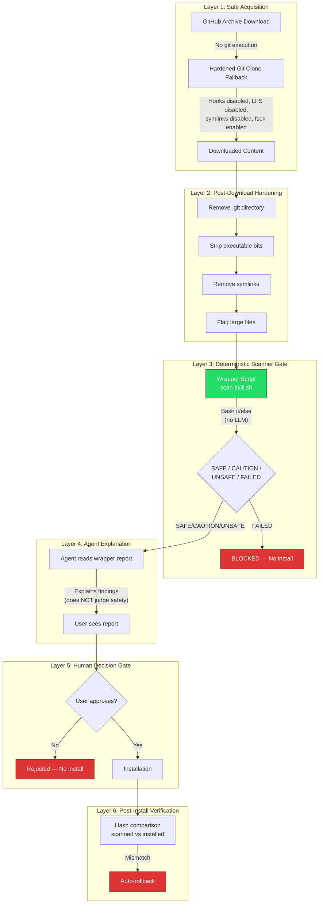
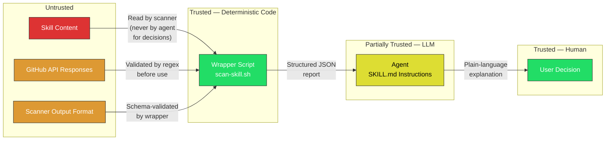

# Workflow Toolkit

Development workflow automation, review orchestration, and productivity tools for enhanced development workflows.

## Features

### Commands

| Command | Description |
|---------|-------------|
| `/dep-check` | Check dependency health and security before adding to project |
| `/git-branch-cleanup` | Clean up merged and stale git branches |
| `/git-safe-commit` | Safe commit workflow with build/test validation |
| `/post-impl-review` | Post-implementation review for completed features |
| `/verify` | Run full verification suite (typecheck, lint, test, coverage, audit) before PR or release |

### Deprecated (Reference Only)

| Command | Description |
|---------|-------------|
| `/bootstrap-project` | ⚠️ Deprecated. Bootstrap a new project with Claude Code best practices. Retained for reference patterns only. |

### Skills

| Skill | Description |
|-------|-------------|
| `open-sourceror` | Prepare Claude Code skills, agents, or collections for open-source sharing. Supports standalone repo creation or marketplace integration into existing plugin repos (e.g., robot-tools). |
| `phased-review` | Multi-stage implementation review with parallel sub-agents, severity-based autonomous fixes, and gated test verification. Runs code quality, architecture, simplicity, documentation, and security reviews in sequence. Supports scope modes: full, code-only, security, simplicity, docs. |
| `safe-skill-install` | Supply chain security scanning for skill installations. Wraps Cisco skill-scanner to vet skills before installation with static + behavioral analysis. Supports MANUAL (default), AUTO-INSTALL, and SECURE modes. **Note:** AUTO-INSTALL mode is off by default — scanner evasion is possible for non-Python files where only static YARA patterns apply. Use SECURE mode for high-security environments. |
| `session-retrospective` | Iterative reflection skill for extracting actionable learnings from Claude Code sessions. Produces agent-ready context documents for future implementation. |
| `plugin-qa` | Validates plugin manifests, README cross-references, SKILL.md frontmatter, version sync, and keyword coverage. Two modes: validate (check and report) and release-prep (validate + version bump workflow). |
| `gh-aw-helper` | GitHub Agentic Workflows — write AI-powered automation in natural-language markdown that compiles to secure GitHub Actions. Covers setup, workflow authoring, triggers, safe I/O, security, MCP tools, 14 operational patterns, engine configuration, and troubleshooting. |

### Agents

| Agent | Description |
|-------|-------------|
| `code-reviewer` | Staff-level Rust code review specialist. Focuses on security, reliability, accessibility, and planning implementations. |
| `idempotency-tester` | Verifies operations are idempotent by running them twice and comparing results. Use for sync operations, data migrations, or API calls. |
| `ops-docs-generator` | Generates operational documentation (troubleshooting, performance, deployment) by analyzing actual codebase patterns. |
| `review-orchestrator` | Coordinates multi-phase code reviews by delegating to specialized agents and managing branch/PR workflows. |

## Installation

### Via Marketplace

```bash
/plugin marketplace add https://github.com/swannysec/robot-tools
/plugin install workflow-toolkit@robot-tools
```

### Manual Installation

```bash
git clone https://github.com/swannysec/robot-tools.git
cd robot-tools
cc --plugin-dir ./workflow-toolkit
```

## Usage

### Commands

Commands are invoked with the `/` prefix:

```
/dep-check lodash                   # Check if lodash is safe to add
/git-branch-cleanup                 # Clean up merged branches
/git-safe-commit "feat: add login"  # Safe commit with validation
/post-impl-review                   # Review completed implementation
/verify                             # Run full verification suite
```

### Skills

Skills activate automatically via trigger phrases:

**open-sourceror**:
- `"prepare for open source"`, `"open source this skill"`
- `"upload skill to github"`, `"share this agent"`
- `"add to marketplace"`, `"add to robot-tools"`
- `"create repo for skill"`, `"package for sharing"`

**phased-review**:
- `"phased review"`, `"run review"`
- `"validate implementation"`, `"pre-release review"`
- `"full review"`, `"security review"`, `"simplicity review"`, `"docs review"`

**safe-skill-install**:
- `"install skill safely"`, `"safe install"`
- `"scan skill"`, `"vet this skill"`
- `"scan and install"`, `"check skill safety"`

**session-retrospective**:
- `"session retrospective"`, `"retro"`
- `"what did we learn"`, `"lessons learned"`

**plugin-qa**:
- `"plugin qa"`, `"validate plugins"`, `"lint plugins"`
- `"prepare release"`, `"bump version"`, `"release prep"`

**gh-aw-helper**:
- `"gh-aw"`, `"gh aw"`, `"agentic workflow"`, `"agentic workflows"`
- `"create agentic workflow"`, `"compile workflow"`, `"workflow frontmatter"`
- `"safe outputs"`, `"safe inputs"`, `"fuzzy schedule"`, `"slash command trigger"`

### Agents

Agents are invoked by Claude Code when their specialized capabilities match the task:

- `code-reviewer`: Activated for code review tasks, especially Rust projects
- `idempotency-tester`: Use when testing sync operations or migrations
- `ops-docs-generator`: Use when creating operational documentation
- `review-orchestrator`: Use for comprehensive multi-phase reviews

### Example Commands

```
"Run a phased review in full mode"
"Run a code-only review before I open the PR"
"Prepare this skill for open source sharing"
"Add this skill to robot-tools research-toolkit"
"Safely install skill from https://github.com/org/skill-repo"
"Scan this skill before installing"
"Run a session retrospective on what we learned"
"Review this Rust code for security issues"
"Test if this sync operation is idempotent"
"Generate ops documentation for the deployment process"
"Orchestrate a comprehensive review of this PR"
"Run plugin QA to check consistency"
"Prepare a release for workflow-toolkit"
"Help me create an agentic workflow for issue triage"
"How do I configure safe outputs for gh-aw?"
"Help me set up fuzzy scheduling for a daily workflow"
```

## Security: safe-skill-install Threat Model

The `safe-skill-install` skill provides supply chain security scanning for skill installations. Because it handles untrusted content by design, its threat model and layered mitigations are documented here.

### Threat Landscape

Skills are code that runs with the same privileges as the user. A malicious skill can:
- Exfiltrate data (environment variables, files, credentials)
- Modify the system (install backdoors, alter configs)
- Manipulate the agent (prompt injection to bypass security checks)

### Layered Mitigation Architecture



### Trust Boundaries



### Known Limitations and Accepted Risks

| Limitation | Mitigation | Residual Risk |
|-----------|-----------|---------------|
| **Prompt injection in skill content** | Wrapper makes security decisions, not agent. Agent only explains post-decision. | Agent could mislead user's understanding of findings, but cannot change the SAFE/UNSAFE classification. |
| **YARA evasion via obfuscation** | Wrapper includes basic obfuscation detection (base64, unicode). Behavioral engine covers Python. | Non-Python files with sophisticated obfuscation may evade detection. Scanner evasion is possible. |
| **Behavioral analysis is Python-only** | Noted in every scan report as a known limitation. | Bash, JS, TS skills get static analysis only. |
| **TOCTOU for npx installs** | Post-install hash verification with auto-rollback on mismatch. | Brief window between scan and install where content could change. |
| **Scanner itself could be compromised** | Version pinning recommended. Scanner is a pip dependency. | Supply chain risk inherent in all dependency-based tooling. |
| **AUTO-INSTALL bypasses human review** | Off by default. Documented caution. Falls back to MANUAL for any medium+ finding. | Clean scan does not guarantee safety. |

### What This Skill Is NOT

- **Not a guarantee of safety.** No automated tool can certify that arbitrary code is safe. This skill raises the cost of attack and catches common patterns.
- **Not a replacement for code review.** For high-value or high-trust scenarios, read the skill source yourself.
- **Not immune to evasion.** Determined adversaries can craft skills that evade static and behavioral analysis. The layered approach makes this harder, not impossible.

## Requirements

- [Claude Code](https://docs.anthropic.com/en/docs/claude-code) CLI
- [GitHub CLI](https://cli.github.com/) (for open-sourceror and safe-skill-install skills)
- [cisco-ai-skill-scanner](https://github.com/cisco/skill-scanner) (for safe-skill-install skill)
- Python 3.6+ (for wrapper script's JSON parsing)

## License

[MIT License with Commercial Restriction](../LICENSE)
